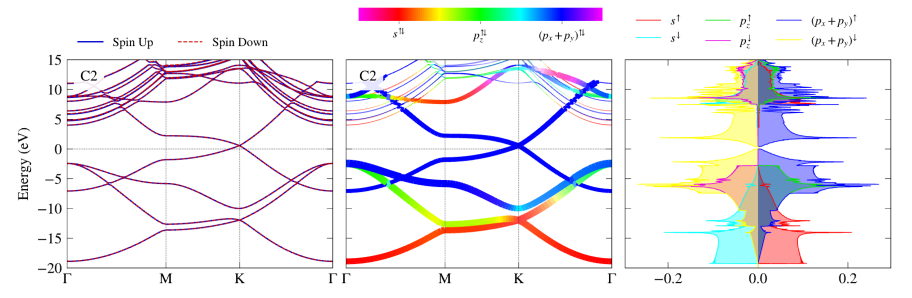

### Hi there 👋

- 🔭 I’m a computational physicist in PhD at University of Delaware. 
- 🌱 I’m currently working on a plotly-dash app for DFT output visualization. 

> 

> > > 

- 💬 Ask me about powershell and python! 
- 😄 Pronouns: He/Him! 

----
👇🏻 Below is a list of the projects I am working/worked on! 👇🏻 
